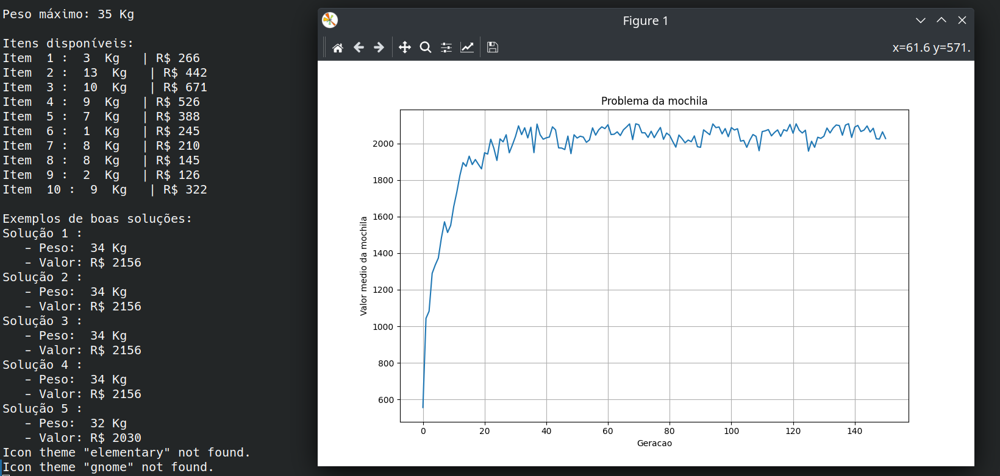

# Repositorio criado para a atividade 3 de Inteligencia Artificial da universidade Federal de Roraima (UFRR) pelo semestre 2023.1

##  Atividade sobre Algoritimos Geneticos

## Problema da mochila 0-1

### Descrição do problema:

-  No problema da mochila 0-1, recebemos um conjunto de itens, cada um com um peso e um valor, e precisamos determinar o número de cada item a ser incluído em uma coleção de modo que o peso total seja menor ou igual a um determinado limite e o valor total é o maior possível. Nesta tarefa você deve solucionar este problema utilizando um algoritmo genético.

- Para ilustrar este problema, imagine a situação hipotética. Um ladrão entra em uma loja carregando uma mochila (bolsa) que pode carregar 35 kg de peso. A loja possui 10 itens, cada um com peso e preço específicos. Agora, o dilema do ladrão é fazer uma seleção de itens que maximize o valor (ou seja, o preço total) sem exceder o peso da mochila. Temos que ajudar o ladrão a fazer a seleção.

**Utilize os seguintes itens para colocar na mochila:**

| ID | PESO | VALOR |
| ------ | ----- | ------|
| 1 | 3 | 266 |
| 2 | 13 | 442 |
| 3 | 10 | 671 |
| 4 | 9 | 526 |
| 5 | 7 | 388 |
| 6 | 1 | 245 |
| 7 | 8 | 210 |
| 8 | 8 | 145 |
| 9 | 2 | 126 |
| 10 | 9 | 322 |

</br>

## Resolvendo o problema

Para esse problema foi criado dois arquivos, um que tem o papel de ter todas as funções do código nomeado de **"genetic.py"** e outro para rodar essas funções e obter as informações necessarias para o programa rodar nomeado de **"mochila_0-1.py"**.
</br>

### Explicando as funções 

```bash
def individual
```
Responsavel por criar um membro da populacao


```bash
def Population
```
Responsavel por criar a população


```bash
def fitness
```
Avalia um indivíduo, calculando seu peso total e valor total com base em uma lista de pesos e valores. Retorna o valor total se o peso não exceder o peso máximo, caso contrário, retorna -1.


```bash
def media_fitness
```
Calcula a média de avaliação da população, levando em consideração apenas os indivíduos que respeitam o peso máximo da mochila.


```bash
def selecao_roleta
```
Seleciona um pai e uma mãe com base nas regras da roleta, onde a probabilidade de seleção é proporcional ao fitness dos indivíduos.


```bash
def evolve
```
realiza a evolução da população. Primeiro, classifica os indivíduos por fitness. Em seguida, seleciona pais para reprodução usando o método da roleta. Em seguida, realiza a reprodução gerando filhos que combinam características dos pais. Por fim, pode ocorrer mutação nos filhos com uma determinada probabilidade. Os filhos resultantes são retornados como a nova população.

<br><br>
<span style="color: red;">OBS </span> Link do video com autor explicando o código detalhadamente: https://www.youtube.com/watch?v=fC4mDO3RGQ8&ab_channel=FredericoBender
<br><br>

## Como executar o código:

### versão do python 

Python 3.x (versão usada na criação do programa)


### Para execultar o grafico é nescessario a bibioteca matplotlib, se não tiver faça o seguinte comando

```bash
    pip install matplotlib
```

### Se todos os requisitos estiverem satisfeitos rode o programa com esse comando: 

```bash
    python3 mochila_0-1.py
```
<br>

## Foto do Resultado

### Datos que foram utilizados para na execução:

- Quantidade de cromossomos: 80
- Quantidade de gerações: 150



<br><br>
## Referências


**Todos os créditos da codificação são do seguinte repositório:**

- https://github.com/FredericoBender/Algoritmo-Genetico-Problema-da-Mochila/tree/main