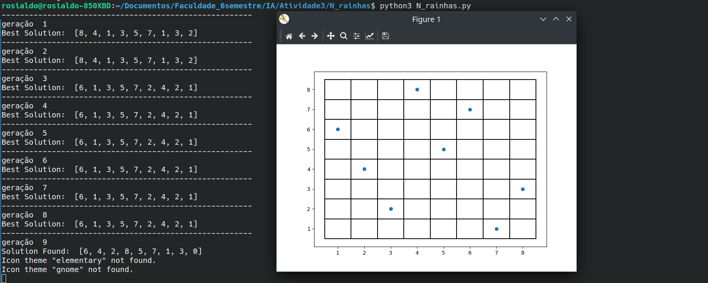

# Repositorio criado para a atividade 3 de Inteligencia Artificial da universidade Federal de Roraima (UFRR) pelo semestre 2023.1

##  Atividade sobre Algoritimos Geneticos

### Problema das N-rainhas

O problema das N-rainhas consiste em encontrar todas as combinações possíveis de N rainhas num tabuleiro de dimensão N por N tal que nenhuma das rainhas ataque qualquer outra. Duas rainhas atacam-se uma à outra quando estão na mesma linha, na mesma coluna ou na mesma diagonal do tabuleiro. Nesta tarefa você solucionar o problema das n-rainhas utilizando um algoritmo genético.

### Resolvendo o problema

Para A solução do problema foi implementado 5 funçoes, a seguir vamos identificar qual são seus responsabilidades dentro do dentro do nosso codigo 

```bash
def randomGeneration
```

Essa função cria uma população aleatória de indivíduos para resolver o problema das n-rainhas. Ela recebe o número de indivíduos e o número de rainhas como entrada. Em cada iteração do loop, são geradas posições aleatórias para as rainhas, que são adicionadas à população. A função retorna a população gerada.


```bash
def fitness
```

A função fitness verifica o número de conflitos em cada indivíduo da população, no problema das n-rainhas. Para cada indivíduo, ela compara a posição de cada rainha com as demais, contando os conflitos. Em seguida, atualiza a última posição do indivíduo com o número de conflitos encontrados. Depois, a população é ordenada com base nessa contagem, do menor para o maior valor. Por fim, a função retorna a população ordenada.

```bash
def cross_over
```

A função realiza o cruzamento entre indivíduos em uma lista de gerações. Ela cria novos indivíduos "filhos" combinando características dos pais. Cada par de pais gera dois filhos. Os primeiros genes dos filhos são copiados dos pais, e os segundos genes são trocados entre os pais. Os filhos são adicionados à lista de gerações. Ao final, a função retorna a lista atualizada com os filhos gerados pelo crossover.


```bash
def mutation
```
Realiza a mutação em uma lista de gerações. Ela seleciona aleatoriamente metade dos indivíduos da população para sofrer mutação. Para cada indivíduo selecionado, um gene aleatório é escolhido e substituído por um novo valor aleatório. Essa mutação introduz variação genética na população. A função retorna a lista de gerações atualizada com as mutações realizadas.


```bash
def showRes
```

A função showRes exibe um gráfico de dispersão para visualizar os resultados. Ela recebe uma lista res como entrada, que contém os valores a serem plotados. O gráfico é exibido na saída.

## Como executar o programa

#### Requisitos para executar:

#### versão do python 

Python 3.x (versão usada na criação do programa)


#### Para execultar o grafico é nescessario a bibioteca matplotlib, se não tiver faça o seguinte comando

```bash
    pip install matplotlib
```

#### Se todos os requisitos estiverem satisfeitos rode o programa com esse comando: 

```bash
    python3 N_rainhas.py
```


## Foto do resultado 



<br></br>

## Referências

* https://github.com/RaminSaljoughinejad/Python-3.0-Course/blob/master